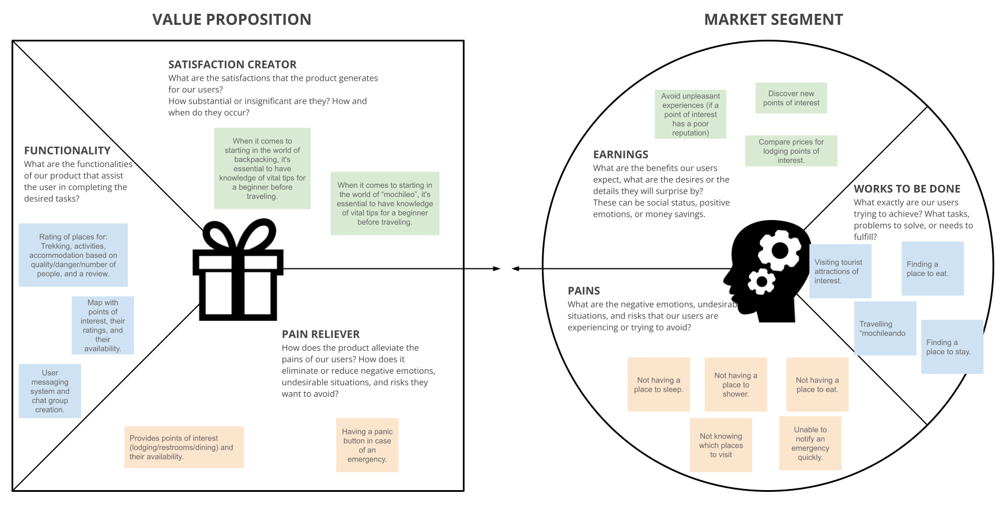
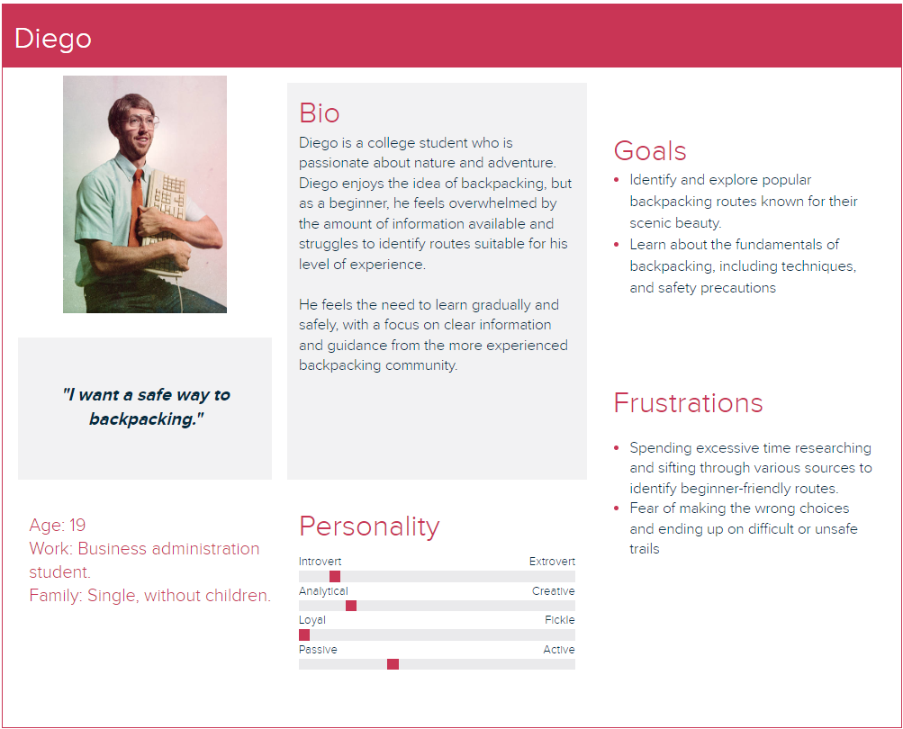

# MochilApp UXD

## Index
- [Description](#description)
- [Team](#Team)
- [Strategy](#strategy)
- [Scope](#scope)
- [Structure](#structure)
- [Skeleton](#skeleton)
- [Surface](#surface)

---

## Description
"Backpacking" can be an exciting and rewarding activity, but it can come with inconveniences as one travels. To avoid these issues and fully enjoy the experience without worries, "MochilApp" was created. It's an application designed to assist all those travelers who choose to use this unique method.

The app aims to help "backpackers" by allowing them to share their experiences through articles/reviews of visited places. It also aims to provide personalized points of interest recommendations to the user, display arrival routes and usable trails. Additionally, the app offers a safety feature to the user, including a panic button for emergencies. This button will alert the authorities while providing real-time user location. These and other functionalities are the support that "MochilApp" seeks to provide to all users looking for an exciting way to travel and enjoy a hassle-free experience. 

---

## Team

Manuel Alvial - Designer

Claudio Churque - Analyst

Maximiliano Cortés - Designer

Cristóbal Matus - Project Manager

Joaquín Villagran -  Analyst

--- 
## Strategy
The first step within the "Elements of User Experience" is the Strategy plane. A "Value Proposition Canvas" was used to determine what solution to provide based on the customer's need.

This process is carried out with a strategic focus that enables a deep understanding of the value proposition. As the previous figure is analyzed, several important elements closely aligned with customer needs and expectations can be highlighted. These key aspects serve as a guide for making informed decisions in the improvement and evolution of the solution. Furthermore, this process demonstrates a mindset of iteration and continuous improvement.

---
## Scope

Upon establishing our product strategy, the next step is to define the scope, which involves understanding our users and envisioning the functionality of our product for their benefit.

The UX Personas image introduces the archetypical users of "MochilApp," offering insights into their diverse needs, preferences, and goals, aiding in tailoring the application to serve them effectively.

Next, the Customer Journey Map (CJM) visualizes the anticipated user experience, mapping out the different stages of interaction between the user and the app.

Additionally, strategic objectives previously identified are transformed into actionable insights using the Benchmarking Canvas, enabling the translation of these objectives into practical features and functionalities for "MochilApp."

The Benchmarking Canvas image showcases a comparative analysis of key competitors, providing a comprehensive view of their strengths and weaknesses to guide the enhancement and differentiation of "MochilApp."

---
## Structure

---

## Skeleton

Wireframes are essential in the design and development of digital products, as they provide a simplified visual representation that facilitates early planning, communication, and prototyping, enabling teams to define the structure and design of an interface clearly and efficiently. This saves resources and prioritizes a user-centered approach to achieve more effective and user-friendly interfaces.

---

## Surface

In this section, you can explore the mockups we've created to address the challenge. For a more comprehensive view, we invite you to check out the project on  [Figma](https://www.figma.com/file/EL05MCzEQbYjBmvMGHqBex/Untitled?type=design&node-id=0%3A1&mode=design&t=wkj2wCjB7bGjNAU8-1) where you can also explore its full range of functionalities.

